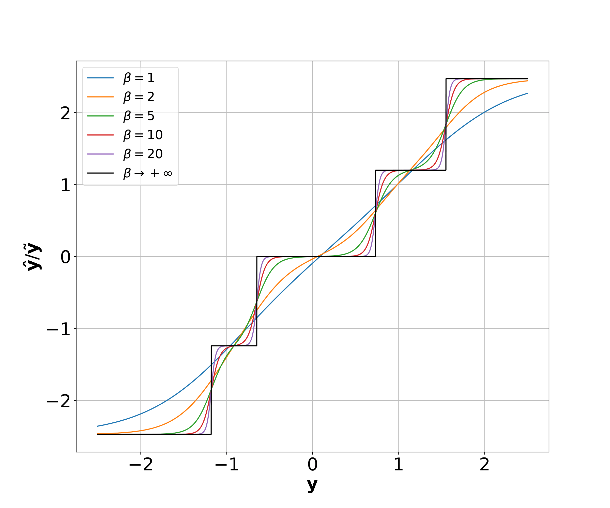
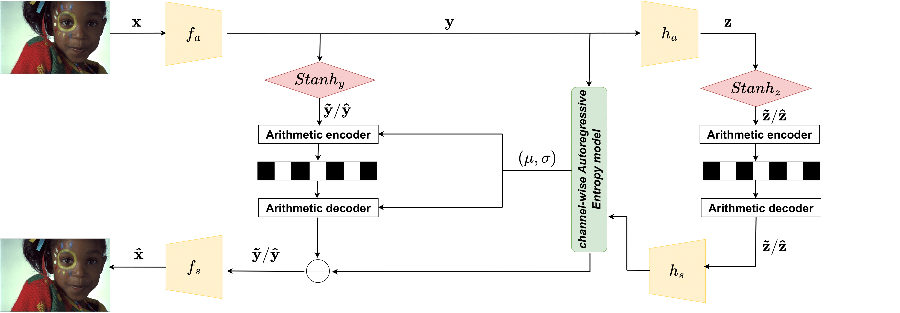

# STanH : Parametric Quantization for Variable Rate Learned Image Compression


Pytorch implementation of the paper "**STanH : Parametric Quantization for Variable Rate Learned Image Compression**",  accepted at TIP. This repository is based on [CompressAI](https://github.com/InterDigitalInc/CompressAI) and [STF](https://github.com/Googolxx/STF)

[Paper link](https://arxiv.org/abs/2410.00557)


<div align="center">

<p><em>STanH activation function with 5 quantization
levels and for increasing values of inverse temperature β.</em></p>
</div>


## Abstract
In end-to-end learned image compression, encoder
and decoder are jointly trained to minimize a R + λD cost
function, where λ controls the trade-off between rate of the
quantized latent representation and image quality. Unfortunately,
a distinct encoder-decoder pair with millions of parameters must
be trained for each λ, hence the need to switch encoders and
to store multiple encoders and decoders on the user device for
every target rate. This paper proposes to exploit a differentiable
quantizer designed around a parametric sum of hyperbolic
tangents, called STanH , that relaxes the step-wise quantization
function. STanH is implemented as a differentiable activation
layer with learnable quantization parameters that can be plugged
into a pre-trained fixed rate model and refined to achieve different
target bitrates. Experimental results show that our method
enables variable rate coding with comparable efficiency to the
state-of-the-art, yet with significant savings in terms of ease of
deployment, training time, and storage costs.

<div align="center">

<p><em>The reference learned image compression architecture Zou22  (CNN-based architecture) with two STanH layers for quantizing the main latent space y and the hyperprior latent space z.</em></p>
</div>

## Preparation 
In order to use this code, You can create a conda environment, with CUDA if you use GPU (suggested)

```
conda create -n $NAME python=3.8
conda activate $NAME

conda install pytorch==1.11.0 torchvision==0.12.0 torchaudio==0.11.0 cudatoolkit=11.3 -c pytorch
pip install -r requirements.txt
```


## Validate

Download our pretrained model (based on Zou2022) in the following directory from [here](https://drive.google.com/drive/folders/1LJ6nmQZJyMaJKFzr-sb2C9m9oxHE5pE5).


```
cd src 

python demo.py \
--image_path #path-for-the-image-to-encode \ 
--model_checkpoint #path-for-the-checkpoint-of-the-anchor \
--stanh_path #path-where-stanhs-are-saved \ 
--wandb_log #if-ypu-want-wandb-plot \ 
--entropy_estimation #estimation-of-entropy (faster) 
--path_save #path-where-to-save-results \
--interpolation #to include-interpolated-points
--device cuda
```

Until now, we use Torcach to perform Arithmetic coding (very slow), in future code will be adapted to use RANS as standard model in CompressAI library